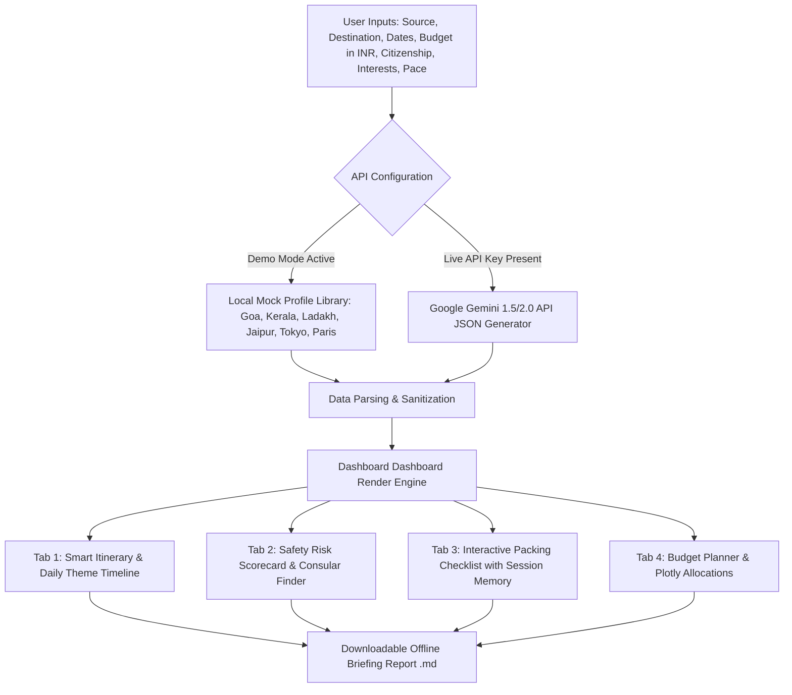

# TravelSafe-AI – Intelligent Travel Planning and Safety Assistant

<p align="center">
  
</p>

<p align="center">
  <b>An Intelligent Travel & Safety Planner designed for modern Indian travelers.</b>
</p>

---

TravelSafe AI is a modern, responsive Streamlit web application designed to help travelers plan safe, well-organized, and budget-conscious trips. By utilizing AI-generated recommendations, the application produces detailed day-by-day itineraries, weather-optimized checklists, comprehensive local safety advisories, consular embassy locations, emergency phone numbers, and customized financial breakdowns.

---

## 📐 System Workflow & Architecture

Below is the conceptual flow of the TravelSafe AI system, mapping user configuration to final output modules:



---

## 🌟 Key Features

1. **Smart Itinerary Planner**: Custom-tailored daily schedules based on user travel type (Solo, Family, Business), activity pace, and personal interests.
2. **Interactive Safety Risk Scorecard**: Visual indices rating risk across critical categories: Physical Safety, Health Standards, Scam/Theft Frequency, and Solo Traveler Friendliness.
3. **Emergency Hotline Generator & Consular Finder**: Custom emergency contacts (Police, Ambulance) and Indian citizen-specific embassy details (names, addresses, phones) for offline emergency prep.
4. **Adaptive Packing Checklist**: Automatically generates packing items based on travel weather and parameters, supporting persistent user-defined items.
5. **Interactive Budget Allocator**: Dynamic visual charts (Plotly donut charts) allocating finances across categories (Accommodation, Transport, Gastronomy, Activities, Emergencies) in Indian Rupees (₹ INR) and local currency.
6. **Offline Markdown Exporter**: Instantly generates a print-ready markdown report containing the complete itinerary, emergency codes, and vocabulary translations for offline device usage.
7. **Robust Dual-Mode Core**:
   * **Live AI Mode**: Secure integration with Google Gemini LLMs for customized real-time processing.
   * **High-Fidelity Demo Mode**: High-density built-in profiles for Tokyo, Paris, Goa, Kerala, Leh Ladakh, and Jaipur that work immediately out-of-the-box without requiring an API key.

---

## 🤖 GitHub Actions CI/CD Workflow

This project includes a **Python Application CI** GitHub Actions workflow located in `.github/workflows/python-app.yml`.

### Workflow Steps:
* **Trigger**: Runs automatically on every `push` or `pull_request` targeting the `main` branch.
* **Environment Setup**: Provisions an Ubuntu runner and configures Python 3.10.
* **Dependency Installation**: Upgrades pip and runs `pip install -r requirements.txt` to verify install integrity.
* **Linting Code Quality**: Executes `flake8` to run strict Python syntax analysis, catching undefined variables, import errors, or layout inconsistencies automatically before merges.

---

## 🛠️ Technology Stack

* **Front-End & UI Framework**: [Streamlit](https://streamlit.io/)
* **Charts & Visualization**: [Plotly](https://plotly.com/)
* **AI Model Engine**: [Google Generative AI (Gemini 1.5/2.0 API)](https://ai.google.dev/)
* **Data Processing**: [Pandas](https://pandas.pydata.org/)
* **Styling**: Vanilla CSS (embedded) with Streamlit configurations (`.streamlit/config.toml`)
* **Graphics**: Python Pillow

---

## 📁 Project Structure

```text
c:\Users\user\Desktop\Capstone/
│
├── .github/
│   └── workflows/
│       └── python-app.yml   # GitHub Actions CI linting workflow
│
├── .streamlit/
│   └── config.toml          # Custom dark mode palette & server configs
│
├── assets/
│   └── logo.png             # TravelSafe AI logo asset
│
├── src/
│   ├── app.py               # Main application layout, sidebar, tabs, and session state manager
│   ├── ai_engine.py         # Gemini API connector & cached local data profiles
│   ├── utils.py             # Validation, budget calculations, Plotly charts, and export templates
│   └── styles.css           # Glassmorphism cards, metric widgets, and custom timeline components
│
├── requirements.txt         # Package dependencies
└── README.md                # Project documentation with Mermaid architecture
```

---

## ⚙️ Installation & Setup

Follow these steps to run the application locally on your Windows terminal:

### 1. Prerequisites
Ensure you have Python 3.9+ and `pip` installed:
```powershell
python --version
```

### 2. Navigate to Workspace
Open your PowerShell terminal and go to the project directory:
```powershell
cd "c:\Users\user\Desktop\Capstone"
```

### 3. Install Dependencies
Install all required libraries using `pip`:
```powershell
pip install -r requirements.txt
```

### 4. Setup Gemini API Key (Optional)
If you want to use **Live AI Mode**, obtain a Gemini API key from [Google AI Studio](https://aistudio.google.com/) and set it in your environment:
```powershell
$env:GEMINI_API_KEY="your_api_key_here"
```
*Note: You can also enter the API key directly within the app sidebar at runtime, or run in Demo Mode (no key required).*

### 5. Launch the Application
Run the Streamlit server:
```powershell
python -m streamlit run src/app.py
```
The app will automatically launch in your default web browser at `http://localhost:8501`.

---

## 💡 How to Use

1. **Configure API**: Toggle **Demo Mode** on the sidebar or enter your Gemini API Key.
2. **Set Parameters**: Input your starting location, destination, departure and return dates, and budget.
3. **Select Preferences**: Pick your travel type (e.g., Solo, Family), pace, and interests.
4. **Generate**: Click **Generate Safe Itinerary**.
5. **Explore Tabs**:
   * Review statistics cards and weather forecasts.
   * View the interactive day-by-day planner.
   * Examine risk indexes, embassy locations, and local emergency phrases.
   * Customize and check items in the packing list.
6. **Save Report**: Scroll to the bottom and click **Download Trip Briefing Report (.md)** to save a copy offline.

---

## 📸 App Screenshots

*(Once the application is running, capturing and placing interface screenshots here is recommended for capstone display)*

| Dashboard Overview | Smart Itinerary & Timeline |
| :---: | :---: |
| *[Overview Screen]* | *[Timeline Details]* |

| Safety & Consular Details | Expense Category Chart |
| :---: | :---: |
| *[Embassy & Risk Info]* | *[Plotly Allocations]* |
